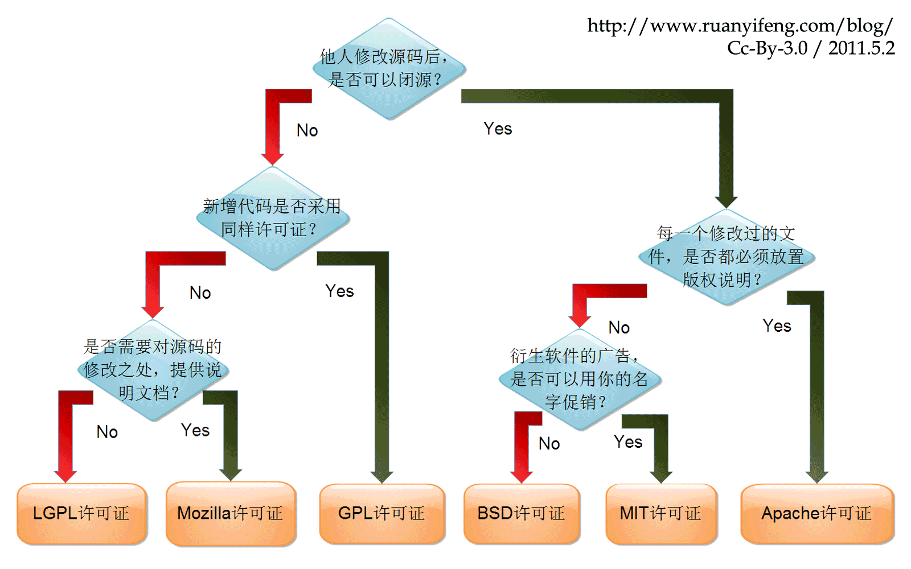

# 如何选择开源许可证？

## 开源许可证是什么？

开源许可证是一种协议，具有合同性质。权利人在拥有知识产权的情况下，通过许可协议，将其拥有的权利 **有条件** 地许可或让渡给使用者。

## 如何选择软件开源许可证？

>世界上的开源许可证，大概有上百种。很少有人搞得清楚它们的区别。即使在最流行的六种----GPL、BSD、MIT、Mozilla、Apache和LGPL----之中做选择，也很复杂。

我在 GitHub 上为项目选择开源许可证时，面对如此多的协议，一下子就蒙了，正当我犯难时，我看到了一张图片，来自 [**阮一峰大佬的翻译**](https://www.ruanyifeng.com/blog/2011/05/how_to_choose_free_software_licenses.html)

图片翻译自 [Simple description of popular software licenses](https://paulmillr.com/posts/simple-description-of-popular-software-licenses/)

这是我见过的最简单的讲解。而你也可以通过一些网站帮助你选择，比如:

- <https://choosealicense.rustwiki.org/>  
- [各类许可证](https://www.gnu.org/licenses/license-list.html)

## 文章许可协议

许多人会把它和开源协议混淆，实际上这是不同的东西，CC协议可参照官网 <https://creativecommons.org/licenses/>，有官方中文，很好理解。

> 原文地址：<https://purplemoon0.github.io/PM_WIKI/>  
> 本篇文章受 [CC BY-NC-SA 4.0](https://creativecommons.org/licenses/by-nc-sa/4.0/legalcode.zh-hans) 协议保护，转载请注明出处。